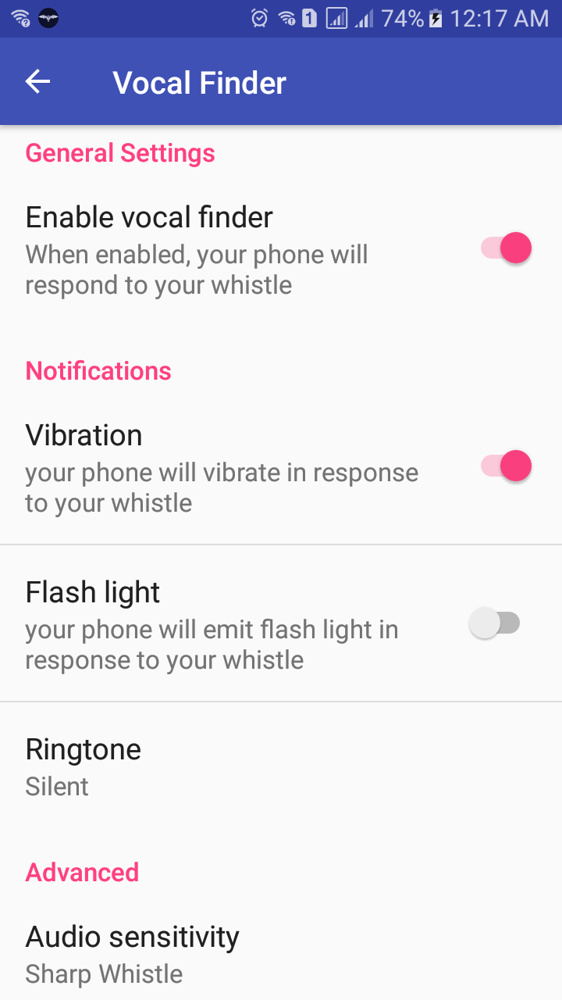
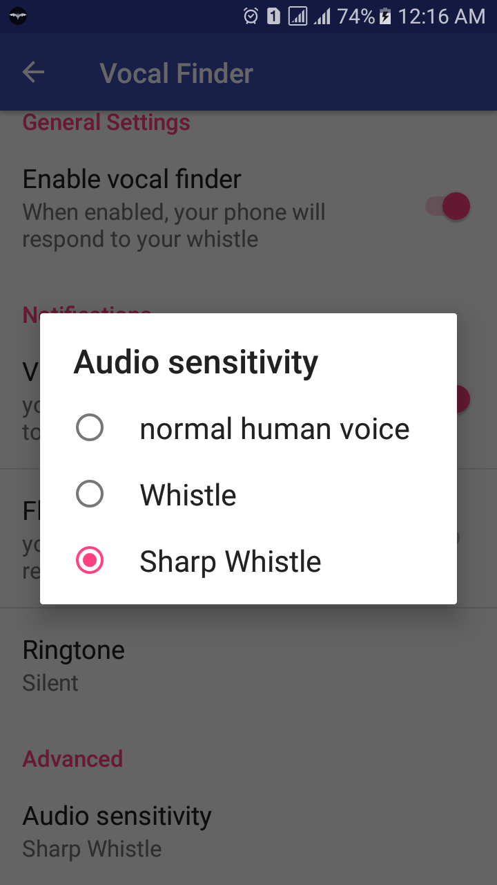
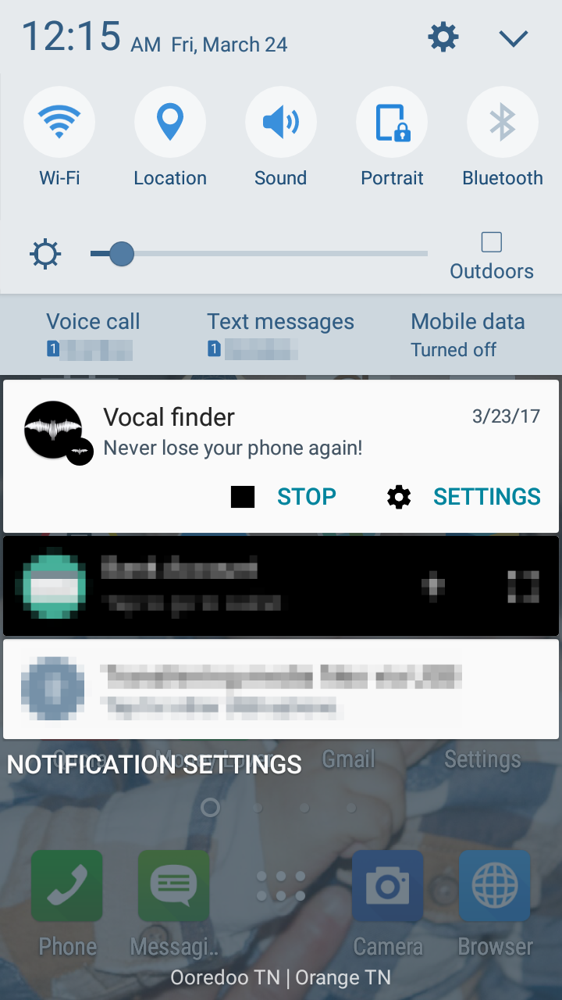

# Vocal finder

Did you ever put your phone somewhere and then you forgot where? Did you ever wasted minutes to find it? You should install this app.

This application detects voices and will start vibrating, emitting a ringtone and flash to indicate its position.
Audio sensitivity is configurable to meet our preferences.

## How does it work?
Start the application. Choose the way in which your lost phone will inform you about its position. You have multiple choices in app settings:
- Ringtone: Choose the sound notification which will be played when the phone is found.
- flash light: Your phone will start the flash lamp of the camera, which will make finding the phone easier and faster.
- vibration: The telephone will start vibrating at the moment of whistle detection.
- save battery: you can set listening out for the whistle only while the screen of the phone is off.
- Detection of incoming connection: This option will unblock the microphone used to detect a whistle when the phone receives a call.
After the phone call, the phone will continue listening out for the whistle.
- configure the microphone sensitivity. The effectiveness of whistle detection depends on built-in microphone and number of noises and sounds of surrounding.

## Snapshots

## Special Thanks
* contributors to  [Parceler](http://parceler.org/) library
* contributors to [TarsosDSP](https://0110.be/tags/TarsosDSP) project
* @txusballesteros to his [snake](https://github.com/txusballesteros/snake) chart